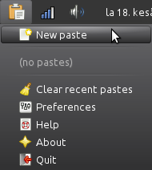

# QasteTray

## Note: QasteTray is not ready yet. If you want a pastebin client that actually works you may want to try [PasteTray](https://github.com/Akuli/pastetray) instead.

QasteTray is a simple tool for using online pastebins written in PyQt5.

If you have a lot of text to send to somebody and you don't want to send
it in a file you can use an online pastebin. Just paste your text there,
click the paste button and share the link. Or better yet, use an online
pastebin with QasteTray. This is especially useful for programmers.



These pastebins are supported by default. You can also use them without
QasteTray. Just click the link.

- [dpaste](http://dpaste.com/)
- [Ghostbin](https://ghostbin.com/)
- [GitHub Gist](https://gist.github.com/)
- [hastebin](http://hastebin.com/)
- [Paste ofCode](http://paste.ofcode.org/)
- [termbin.com](http://termbin.com/)

[Writing custom pastebin scripts in Python](writing-pastebins.md) is
also possible.

## License

QasteTray comes with no warranty. See [LICENSE](LICENSE).

## Downloading, running and installing

To run QasteTray, you need to install Python 3 and PyQt5 if you don't
already have them installed. Windows downloads are
[here](https://www.python.org/downloads/) and
[here](https://www.riverbankcomputing.com/software/pyqt/download5). Most
GNU/Linux distributions come with Python preinstalled, and if something
is not installed you can use the distribution's package manager to
install it. For example, you can use this terminal command on
Debian-based distributions, like Ubuntu and Linux Mint:

```
sudo apt-get install python3-{pyqt5,pip}
```

When you have everything installed you can install and run QasteTray.
This will install it user-wide, so everything will be inside your home
directory.

Windows:

```
py -m pip install --user git+git+https://github.com/Akuli/qastetray
py -m qastetray
```

Most other platforms:

```
python3 -m pip install --user git+git+https://github.com/Akuli/qastetray
python3 -m qastetray
```

A tray icon should appear in your system tray.

Uninstalling is easy:

```
python3 -m pip uninstall qastetray
```

I'll probably make distribution packages (at least a Debian package and
a Windows installer) of QasteTray later to make installing and running
it easier.

## Authors

I'm Akuli and I have written most of QasteTray, but I want to thank
these people for helping me with it:

- [SquishyStrawberry](https://github.com/SquishyStrawberry/) wrote the
original versions of Paste ofCode and hastebin scripts.
- [Chisight](https://github.com/Chisight/) came up with the idea of
making a pasting application and wrote the original ghostbin pasting
script. His version of it is available in his
[ghostbinit repository](https://github.com/Chisight/ghostbinit).
